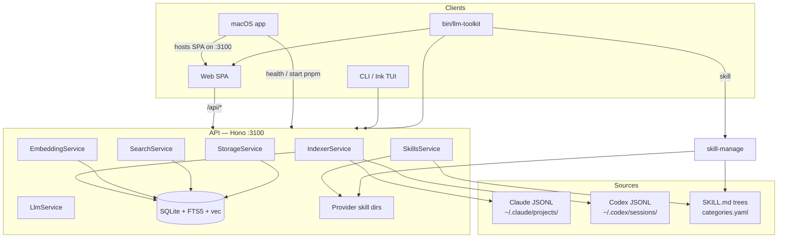

# Project Architecture

## Overview

**llm-toolkit** (product names *Claude Assist* / *agent-watch-dog*) is a local-first developer tool. It indexes coding-agent conversation logs, serves them through a REST API, and lets you search, browse, edit, convert, and extract artifacts — plus enable SKILL.md packages into each harness’s install folders.

Clients: React SPA, native macOS host (WKWebView around that SPA), Ink TUI, and one-shot CLI. Transcripts stay on disk as JSONL; SQLite is a derived index. LLM features are optional. The repo also embeds **skill-manage**, a Rust symlink linker invoked as `llm-toolkit skill …`.

Self-contained at `Portfolio/Apps/AI/llm-toolkit` (pnpm workspaces + Rust crate). No k8s/Helm deploy. `make install` wires the CLI; `make install-osx` binplaces `/Applications/LLM Toolkit.app`.

## System Diagram

## Core Components

| Component | Package | Purpose |
|-----------|---------|---------|
| StorageService | api | SQLite WAL: harness schema, FTS5, sqlite-vec, settings |
| IndexerService | api | Scan JSONL → raw events → universal + flat messages; chokidar watch |
| EmbeddingService | api | Local MiniLM 384-dim (`@huggingface/transformers`) |
| SearchService | api | FTS5 + semantic (cosine / sqlite-vec) |
| LlmService | api | Optional completions (Anthropic + OpenAI-compatible) |
| Editor / Operations | api | Versioned edits; clone, rehome, archive, tag |
| Converter / Exporter | api | Extract artifacts; export datasets |
| Harness transform / transfer | api | Claude/Codex export payloads; transfer façade still pending |
| Session workflow | api | Continue / transfer continuation stubs |
| SkillsService | api | Scan `categories.yaml` + SKILL.md; symlink enable/disable |
| ArtifactsService | api | Agents/commands file symlinks + MCP config entries |
| Hono routes | api | conversations, search, datasets, prompts, projects, tags, config, index, llm, skills, agents, commands, mcp, health |
| Web SPA | web | Explore, thread, edit, convert, continue, library pages, Skills/Agents/Commands/MCP, Settings |
| macOS host | apps/macos | SwiftUI + WKWebView; native sidebar/menus; `make install-osx` |
| CLI / TUI | cli | One-shots (`recent`, `search`, …) + full-screen Ink app |
| Shared | shared | Types, JSONL parsers, `ensureApi()` |
| skill-manage | skill-manage/ | Rust CLI/TUI symlink manager |
| bin/llm-toolkit | root | zellij-aware launcher, skill proxy, CLI dispatch |

## Data Flow

IndexerService discovers harness JSONL, stores **raw events**, normalizes **universal messages**, flattens **search messages**, and optionally embeds. Clients talk to `localhost:3100` except `llm-toolkit recent` (direct SQLite). Skills linking is filesystem-only.

→ *See [arch/data-flow.md](arch/data-flow.md)*

## Storage

SQLite at `~/.llm-toolkit/llm-toolkit.db` (`LLM_TOOLKIT_DATA_DIR`; legacy `CLAUDE_ASSIST_*` aliases). WAL; sqlite-vec optional. Tables: conversations/messages, universal + raw layers, work items, edits, datasets, prompts, project/tag metadata, settings, FTS5, vec0.

→ *See [arch/storage.md](arch/storage.md)*

## Multi-Harness (agent-watch-dog)

Canonical `UniversalMessage` sits between importers and exporters. Claude and Codex importers are live; Gemini / OpenCode / Aider are stubbed. Transform exporters exist for Claude and Codex; transfer write-back is still pending.

→ *See [arch/agent-watch-dog.md](arch/agent-watch-dog.md)*

## Skills / Agents / Commands / MCP

Web **Skills**, **Agents**, **Commands**, and **MCP** pages (and `llm-toolkit skill` for the first three) point a canonical source tree at per-provider global and project dests (Claude, Codex, Grok, Gemini, OpenCode). Skills/agents/commands enable as symlinks; MCP writes a named server block. Disable never deletes a real copy.

→ *See [arch/skills.md](arch/skills.md)* · crate: [skill-manage/docs/PROJ-ARCH.md](../skill-manage/docs/PROJ-ARCH.md)

## Infrastructure / Runtime

| Concern | Notes |
|---------|--------|
| Deploy | Local developer tool — not a k8s service |
| CLI install | `make install` → deps, skill-manage, completions, `~/.local/bin/llm-toolkit` |
| Mac install | `make install-osx` → `/Applications/LLM Toolkit.app` (not part of `make install`) |
| API | `:3100` (`PORT` / `LLM_TOOLKIT_API_PORT`); also serves `packages/web/dist` when present |
| Vite | `:5173` (`LLM_TOOLKIT_WEB_PORT`) for hot reload |
| Data | `~/.llm-toolkit` |
| Index defaults | Claude `~/.claude/projects`, Codex `~/.codex/sessions` |
| CORS | localhost / 127.0.0.1 origins (Vite and API-hosted SPA) |
| Auth | None — single-user local use |

## Key Design Decisions

- **Local-first** — search/index needs no network; LLM optional
- **JSONL is source of truth** — DB is derived; edits version, never mutate transcripts
- **Raw before universal** — keep provider-native events for re-parse and audit
- **Universal transfer only** — no direct provider-to-provider conversion
- **One SPA, two windows** — browser and Mac host the same React console
- **Symlink skills/agents/commands, don’t copy** — one canonical tree; per-harness dests; MCP is a config entry
- **Launcher-centric UX** — one PATH entry for web, TUI, API, and `skill`

## Technology Stack

| Layer | Technology |
|-------|------------|
| Runtime | Node.js (tsx) |
| API | Hono + @hono/node-server |
| Database | better-sqlite3 + sqlite-vec |
| Embeddings | @huggingface/transformers (`all-MiniLM-L6-v2`) |
| LLM | @anthropic-ai/sdk + openai-compatible |
| Watch | chokidar |
| Web | React 18, Vite 6, React Router 7, Tailwind 3.4 |
| Markdown | react-markdown, KaTeX, Mermaid, syntax highlighter |
| CLI | Ink 5 |
| macOS | Swift 5.10, SwiftUI, WebKit (macOS 14+) |
| skill-manage | Rust (clap + ratatui) |
| Packages | pnpm workspaces (`packages/*`) |
| Launcher | bash (`bin/llm-toolkit`) |

## Layout

[PROJ-LAYOUT.md](PROJ-LAYOUT.md) · [layout/api.md](layout/api.md) · [layout/cli.md](layout/cli.md) · [layout/web.md](layout/web.md) · [layout/shared.md](layout/shared.md) · [layout/macos.md](layout/macos.md)
