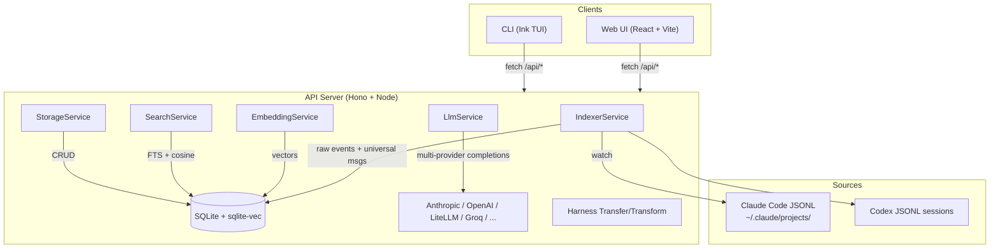

# Project Architecture

## Overview

Claude-assist is a local-first tool for searching, browsing, editing, and extracting reusable artifacts from AI coding-agent conversation logs. Originally a Claude Code log browser, it is evolving into **agent-watch-dog** — a session-continuity tool for multiple agent harnesses (Claude Code and Codex importers implemented; Gemini, OpenCode, Aider stubbed). It reads JSONL transcripts from configured sources (e.g. `~/.claude/projects/`), indexes them into a SQLite database with full-text and vector search, and exposes the data through three interfaces: a REST API, a browser UI, and a terminal TUI.

It lives at `utilities/agent/llm-toolkit/` in the Noizu Infra monorepo but is a self-contained pnpm/TypeScript project — it does not use the shared `share/k8-lib` shell library or `.infra-config.yaml` build metadata. Its own `Makefile` (`make install`) installs pnpm deps and symlinks `bin/llm-toolkit` into `~/.local/bin`, matching the monorepo's utilities-on-PATH convention.

## System Diagram

## Core Components

| Component | Package | Purpose |
|-----------|---------|---------|
| StorageService | api | SQLite persistence — WAL mode, sqlite-vec vectors, harness-aware schema + migrations |
| IndexerService | api | Scans harness sources, retains raw transcript events, derives universal messages, watches for changes |
| EmbeddingService | api | Local embeddings via `all-MiniLM-L6-v2` (384-dim) |
| SearchService | api | Full-text search (FTS5) + semantic search (cosine similarity) |
| LlmService | api | Multi-provider LLM completions — Anthropic SDK + OpenAI-compatible (OpenAI, LiteLLM/`inference.noizu.com`, Groq, Cerebras, DeepSeek, ZAI) |
| Editor / Operations | api | Non-destructive thread editing (versioned); clone, rehome, archive, tag |
| Converter / Exporter | api | Extract agents/skills/commands/runbooks; export datasets (OpenAI, Anthropic, raw JSONL) |
| Harness transfer/transform | api | `Harness → Universal → Harness` adapter boundaries (exporters stubbed) |
| Session workflow | api | Session continuity workflows across harnesses |
| Hono routes | api | conversations, search, datasets, prompts, projects, tags, config, index, llm |
| Web UI | web | React SPA — Explore (unified search/browse), thread viewer, editor, project detail, datasets, prompts, Safety Watch stub |
| CLI | cli | Ink-based TUI — search, list, show, index commands; interactive mode |
| Shared types | shared | TypeScript types (incl. `UniversalMessage`, `AgentHarness`), JSONL parsers, API launcher |
| bin/llm-toolkit | root | Launcher script — starts API + Web/TUI, zellij-aware pane layout, port health-check |

## Data Flow

Harness transcripts are discovered by the IndexerService, preserved as raw events, normalized into universal messages, and stored in SQLite. Messages are embedded for semantic search via `all-MiniLM-L6-v2`. Clients query via REST. File watching (chokidar) enables incremental re-indexing.

-> *See [arch/data-flow.md](arch/data-flow.md) for details*

## Storage

Single SQLite database at `~/.llm-toolkit/llm-toolkit.db`. WAL journal mode for concurrent reads. sqlite-vec extension for vector similarity search (graceful degradation if unavailable). Core tables plus FTS5 and vec0 virtual tables; `raw_transcript_events` retains provider-native records for audit and replay, and conversations carry a `harness` column.

-> *See [arch/storage.md](arch/storage.md) for details*

## Multi-Harness (agent-watch-dog)

The multi-harness layer models each transcript producer (Claude, Codex, Gemini, ...) as a harness with importer/exporter boundaries around a canonical `UniversalMessage` format. Raw provider events are always retained before normalization; harness-to-harness transfer goes through the universal layer rather than direct provider-to-provider conversion. Safety Watch and memory extraction are documented stubs.

-> *See [arch/agent-watch-dog.md](arch/agent-watch-dog.md) for details*

## Key Design Decisions

- **Local-first**: No external services required for core features — SQLite + local embeddings run entirely on the user's machine (LLM features optionally call external providers)
- **JSONL as source of truth**: Reads harness-native formats directly; database is a derived index — edits create versions, never mutate source files
- **Raw before universal**: Preserve raw transcript events prior to normalization so adapters can be re-run and sessions replayed
- **Hono over Express**: Lightweight, Web Standards-based HTTP framework
- **sqlite-vec over pgvector**: Keeps the single-binary philosophy; no database server needed
- **Monorepo with pnpm workspaces**: Shared types between api/cli/web without publishing

## Technology Stack

| Layer | Technology |
|-------|------------|
| Runtime | Node.js (tsx) |
| API framework | Hono |
| Database | better-sqlite3 + sqlite-vec |
| Embeddings | @huggingface/transformers (all-MiniLM-L6-v2) |
| LLM providers | @anthropic-ai/sdk + OpenAI-compatible endpoints |
| File watching | chokidar |
| Web framework | React 18 + React Router |
| Build tool | Vite |
| Styling | Tailwind CSS |
| CLI framework | Ink (React for terminals) |
| Package manager | pnpm workspaces |
| Language | TypeScript (strict) |
| Launcher | bash (`bin/llm-toolkit`, zellij-aware) |
