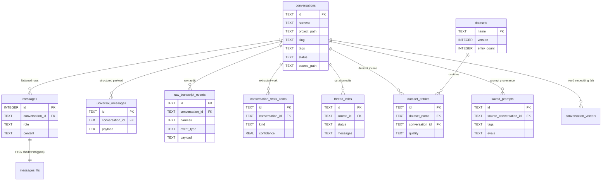
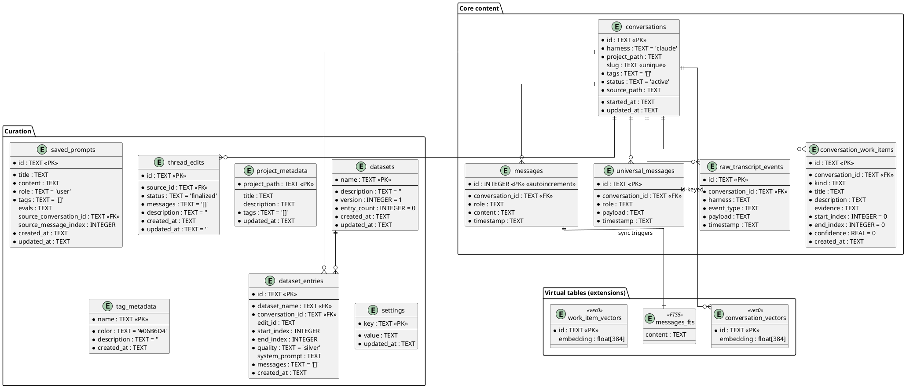

# Project Schema

Data & configuration reference for llm-toolkit. **Persistence layer = a single SQLite
database** (not a client/server SQL DB — there is no Liquibase/Postgres; migrations are
code-level `CREATE TABLE IF NOT EXISTS` + `PRAGMA table_info` column-adds in
[`packages/api/src/services/storage.ts`](../packages/api/src/services/storage.ts), the
authoritative source). Config artifacts (YAML configs, JSON MCP files, env vars) are
documented below alongside the schema. For where each schema source lives in the tree,
see [`docs/PROJ-LAYOUT.md`](PROJ-LAYOUT.md) (API: `packages/api/src/{routes,services}`,
Rust configs: `skill-manage/schema/`, macOS host: `apps/macos/`).

## Database

- Location: `~/.llm-toolkit/llm-toolkit.db` (override via `LLM_TOOLKIT_DATA_DIR`; legacy `CLAUDE_ASSIST_DATA_DIR`)
- Pragmas: `journal_mode = WAL`, `foreign_keys = ON`
- Extensions: `sqlite-vec` (vec0 virtual tables, 384-dim float32). If the extension fails
  to load, vector tables are skipped and semantic search degrades (`vecAvailable = false`).
- Timestamps: TEXT ISO-8601 strings managed by application code (SQLite has no native
  datetime type); column naming convention is `updated_at`/`created_at`.
- IDs: TEXT (application-generated) except `messages.id` (INTEGER AUTOINCREMENT).

### ERD (Mermaid)

### ERD (PlantUML)

## Tables

### Core content

Lossy search layer (`messages`) + lossless layer (`universal_messages`,
`raw_transcript_events`) so harness adapters can improve without data loss.

**conversations** — one row per indexed harness session.

| Column | Type | Nullable | Default | Description |
|--------|------|----------|---------|-------------|
| id | TEXT | No | — | Primary key (harness-assigned / generated) |
| harness | TEXT | No | `'claude'` | Source harness (`claude`, `codex`, `gemini`, `opencode`, `aider`, `other`) |
| project_path | TEXT | No | — | Project/source directory |
| started_at / updated_at | TEXT | No | — | ISO-8601 timestamps |
| message_count | INTEGER | No | 0 | Denormalized count |
| title | TEXT | No | `''` | Display title |
| slug | TEXT | Yes | NULL | UNIQUE URL slug (added by migration) |
| description / summary | TEXT | Yes | NULL | LLM/user metadata |
| tags | TEXT | No | `'[]'` | JSON array of tags |
| status | TEXT | No | `'active'` | Lifecycle status |
| source_path | TEXT | No | — | Original JSONL path |

**Indexes**: `idx_conversations_project (project_path)`, `idx_conversations_updated (updated_at)`, `idx_conversations_harness (harness)`, `idx_conversations_slug (slug)` (unique, added by migration)

**messages** — flattened role/content rows optimized for FTS + list views (lossy by design).

| Column | Type | Nullable | Default | Description |
|--------|------|----------|---------|-------------|
| id | INTEGER | No | AUTOINCREMENT | Primary key; rowid for FTS |
| conversation_id | TEXT | No | — | FK → conversations |
| role / content / timestamp | TEXT | No | — | Flattened message body |

**Indexes**: `idx_messages_conversation (conversation_id)`

**universal_messages** — structured cross-harness messages (JSON `payload`) for transfer, memory hooks, continuation.

**raw_transcript_events** — provider-native records kept verbatim for audit/replay/re-parse (`harness`, `event_type`, JSON `payload`).

**conversation_work_items** — optional LLM-extracted work units: `kind`, `title`, `description`, `evidence`, message range (`start_index`/`end_index`), `confidence` REAL 0–1.

### Curation

**thread_edits** — non-destructive edit versions of a conversation: full `messages` JSON, `status` (default `'finalized'`), `description`.

**datasets / dataset_entries** — named fine-tuning collections; entries reference a conversation (optionally a `thread_edits` id), message range, `quality` (`gold`/`silver`/`bronze`, default `'silver'`), optional `system_prompt`, embedded `messages` JSON.

**saved_prompts** — extracted prompts with `tags` JSON and optional `evals` JSON; optional provenance (`source_conversation_id`, `source_message_index`).

**project_metadata** — user-editable project title/description/tags keyed by `project_path`.

**tag_metadata** — tag display `color` (default `#06B6D4`) + `description`.

**settings** — key/value app config; primary key used today: `app_config` (JSON blob holding LLM provider selection + keys/params; see `packages/api/src/routes/llm.ts`).

### Virtual tables

| Table | Type | Purpose | Sync |
|-------|------|---------|------|
| `messages_fts` | FTS5 (external content) | Full-text over `messages.content` | Triggers `messages_ai`/`messages_ad`/`messages_au` |
| `conversation_vectors` | vec0 | 384-dim float32 embeddings for semantic KNN over conversations | Created only if sqlite-vec loads |
| `work_item_vectors` | vec0 | Embeddings over work items | Same |

**Content hashing**: files are hashed at index time; only new/modified JSONL re-parses
(mod-time/hash tracking in the indexer — no dedicated DB table).

## Migrations

No migration framework. `storage.ts` runs idempotent DDL at every boot, then column-add
migrations via `PRAGMA table_info` checks:

1. `migrateThreadEdits` — adds `thread_edits.status`, `thread_edits.updated_at`
2. `migrateConversationsMeta` — adds `conversations.slug` (+ unique index), `description`
3. `migrateConversationHarness` — adds `conversations.harness` (+ index)
4. `initVectorTable` — loads sqlite-vec, creates vec0 tables (graceful skip on failure)

## Configuration & file-format artifacts

### skill-manage YAML configs (Rust linker)

Templates in [`skill-manage/schema/`](../skill-manage/schema/); installed to `~/.config/skill-manage/`.

| File | Purpose | Top-level keys |
|------|---------|----------------|
| `config.yaml` | Source dirs, provider install targets, defaults | `version`, `sources` (skills/agents/commands → `path` + `priority`), `providers` (claude/codex/grok → `skills_dir`/`agents_dir`/`commands_dir`), `catalog`, `defaults` (`provider: all`, `replace: false`) |
| `catalog.yaml` | Metadata overlay over linked items | `version`, `skills`/`agents`/`commands` (name → `tags`, `work_types`, `providers`, `notes`), `work_types` (name → `description`, `skills`, `agents`, `commands`, `editor_profiles`), `editor_profiles` (name → `description`, `files[]` with `path`+`role`) |

`${SKILL_REPO}` env var is expanded inside source paths.

### MCP config files (read/written by API `mcp-config.ts`)

Format auto-detected by path suffix: `*.mcp.json` (mcp-json), `~/.claude.json`
(claude-json, nested per-project `mcpServers`), `*settings.json` (json-mcpServers),
`.toml` variants (Codex-style). The API reads existing `mcpServers` maps and rewrites
them (JSON or TOML) when registering the llm-toolkit MCP server.

### Runtime data dir (`~/.llm-toolkit/`, env-overridable)

| Path | Content |
|------|---------|
| `llm-toolkit.db` (+ `‑wal`/`‑shm`) | SQLite DB (WAL mode) |

### Environment variables

| Variable | Default | Purpose |
|----------|---------|---------|
| `LLM_TOOLKIT_DATA_DIR` | `~/.llm-toolkit` | Data dir (legacy: `CLAUDE_ASSIST_DATA_DIR`) |
| `LLM_TOOLKIT_WATCH_PATHS` | *(unset → defaults)* | Colon-separated harness source paths |
| `LLM_TOOLKIT_WATCH` | `true` | Enable file watching |
| `PORT` | `3100` | API port |
| `SKILL_REPO` | *(unset)* | skill-manage source path expansion |

Default watch sources: `~/.claude/projects` and `~/.codex/sessions` (JSONL).

## Data interfaces (REST API)

Hono API on `:3100` (see `packages/api/src/routes/`, wired in `index-routes.ts`). All
routes are JSON request/response over the SQLite tables above — no queues, sockets, or
KV store. Route-group → primary data mapping (endpoint-level detail: `docs/arch/data-flow.md`):

| Route group | Endpoints | Primary data touched |
|-------------|-----------|----------------------|
| `conversations` | ~33 | conversations, messages, universal_messages, raw_transcript_events, thread_edits |
| `datasets` | ~15 | datasets, dataset_entries |
| `artifacts` | ~7 | settings, runtime data dir |
| `search` | ~2 | messages_fts, conversation_vectors (KNN) |
| `projects` / `tags` / `prompts` | ~5 each | project_metadata / tag_metadata / saved_prompts |
| `llm` / `config` | ~6 | settings.app_config (provider selection + keys) |

MCP server registration is exposed through `config` routes (rewrites of host
`mcpServers` maps — see MCP config files section).

Secrets note: LLM provider API keys live inside the `settings.app_config` JSON blob in
the local SQLite file (never committed); no other secret stores are used.
