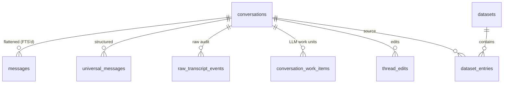

# Project Schema — Summary

Persistence: single SQLite file `~/.llm-toolkit/llm-toolkit.db` (WAL, FKs ON,
sqlite-vec optional). Schema source: `packages/api/src/services/storage.ts`
(idempotent boot DDL + PRAGMA column-add migrations — no Liquibase/Postgres).

| Table | PK | Cols | Notes |
|-------|----|------|-------|
| conversations | TEXT id | 12 | harness, project_path, slug (uniq), tags JSON, status, source_path |
| messages | INTEGER id | 5 | lossy FTS rows; FK conversation_id |
| universal_messages | TEXT id | 5 | structured JSON payload; cross-harness transfer |
| raw_transcript_events | TEXT id | 6 | provider-native audit/replay |
| conversation_work_items | TEXT id | 10 | kind, evidence, range, confidence |
| thread_edits | TEXT id | 7 | non-destructive edit versions (messages JSON, status) |
| datasets | TEXT name | 6 | fine-tune collections (version, entry_count) |
| dataset_entries | TEXT id | 10 | quality gold/silver/bronze, message range |
| saved_prompts | TEXT id | 10 | tags/evals JSON, conversation provenance |
| project_metadata | TEXT project_path | 5 | title/description/tags |
| tag_metadata | TEXT name | 4 | color (default #06B6D4), description |
| settings | TEXT key | 3 | `app_config` JSON = LLM provider config (holds keys) |

Virtual: `messages_fts` (FTS5, trigger-synced), `conversation_vectors` +
`work_item_vectors` (vec0, float[384], only if sqlite-vec loads).

Config artifacts: `~/.config/skill-manage/{config,catalog}.yaml` (templates in
`skill-manage/schema/`); MCP server registration rewrites `~/.claude.json`,
`*.mcp.json`, `settings.json`, TOML variants; env: `LLM_TOOLKIT_DATA_DIR`,
`LLM_TOOLKIT_WATCH_PATHS`, `LLM_TOOLKIT_WATCH`, `PORT`, `SKILL_REPO`.
Timestamps: TEXT ISO-8601 (`created_at`/`updated_at`).
Data interfaces: Hono REST API on :3100 (`packages/api/src/routes/`) — JSON
request/response over the tables above (conversations ~33, datasets ~15, artifacts,
search via FTS+vec0 KNN, projects/tags/prompts, llm/config). No queues, sockets, or
KV store. Tree map of schema sources: docs/PROJ-LAYOUT.md.
