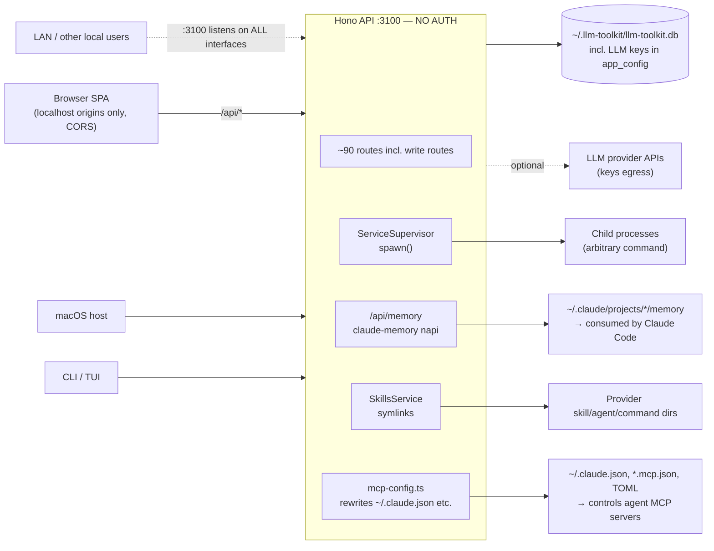

# Threat Model

## Overview

**llm-toolkit** is a single-user, local-first developer tool — but it is a *network-listening process with unauthenticated write access to some of the most security-sensitive files on the machine*: Claude Code / Codex harness configs (`~/.claude.json` MCP entries), project-memory dirs consumed by agents, symlinked skill/agent/command packages, and a process supervisor that spawns arbitrary commands. The crown jewels are (1) indexed transcripts — full source code and pasted secrets, (2) LLM provider API keys in `settings.app_config`, (3) the harness config files that control what code agents execute.

Trust boundaries: **LAN ↔ loopback API** and **API ↔ filesystem/harness configs**. There is no authn/authz anywhere in the API by design (single-user local tool), so the model concentrates on (a) how far the unauthenticated surface actually reaches, and (b) which filesystem writes are agent-consumed and therefore prompt-injection-relevant.

Grounding: components and data flow per [PROJ-ARCH.md](PROJ-ARCH.md); implementing directories per [PROJ-LAYOUT.md](PROJ-LAYOUT.md); data shapes per [PROJ-SCHEMA.md](PROJ-SCHEMA.md).

## Attack Surface

→ *Full enumeration: [threats/local-api-perimeter.md](threats/local-api-perimeter.md) · [threats/fs-write-surface.md](threats/fs-write-surface.md)*

## Vulnerability Register

| ID | Severity | STRIDE | Component | Status |
|----|----------|--------|-----------|--------|
| T-001 | High | Info disclosure | API binds all interfaces (`serve({port})`, no hostname) — transcripts + config readable/writable from LAN | **Open** — CORS is browser-only; no bind pin, no token |
| T-002 | High | Elevation of privilege | ServiceSupervisor executes arbitrary `command` from `npl-plugin.config.yaml`; `/api/services/:name/start` is unauthenticated | Partial — config schema/name validated; RCE-by-design, no auth on trigger |
| T-003 | High | Tampering | MCP config rewrites can register a server entry that points harness agents at an attacker-controlled endpoint (credential/tool exfil) | Partial — only on user action via UI; no origin/allowlist verification of URLs |
| T-004 | Medium | Tampering / Info disclosure | `/api/memory` project path segment is not validated against `..` (`memory_dir = root.join(project)/memory`); slug validation exists in Rust | Partial — slug `..` blocked; project segment escape unverified |
| T-005 | Medium | Tampering | Memory files are consumed by Claude Code agents — poisoned memory = persistent prompt injection surviving sessions | Partial — write surface is the local API only (see T-001); no content provenance |
| T-006 | Medium | Spoofing | DNS rebinding: CORS allows `localhost` origins and the server does not validate the `Host` header — a remote page can rebind to `localhost:3100` and hit the API same-origin | **Open** |
| T-007 | Medium | Info disclosure | LLM provider API keys stored plaintext in `settings.app_config` (SQLite) and returned by config/llm routes | Accepted (local tool; single-user `~` perms) — documented |
| T-008 | Low | Tampering | Symlink enable/disable of skills/agents/commands | Mitigated — refuses to remove real paths; verifies targets stay within sources; never deletes real copies |
| T-009 | Low | Repudiation | No audit log of edits, memory writes, config rewrites | Open (accepted for local tool) |
| T-010 | Low | Supply chain | pnpm deps, prebuilt napi `.node` binaries (`pnpm build:memory-native`), transformers model download | Partial — lockfile committed; `.node` artifacts gitignored/rebuilt locally |

## Mitigation Coverage

2 mitigated · 5 partial · 3 open. Open items (T-001, T-006, T-009) are all on the perimeter: the accepted-risk posture assumes loopback-only reachability, which the code does not currently enforce.

## Residual Risk

Accepted: plaintext keys in local SQLite (T-007), no audit trail (T-009). Both are single-user-local trade-offs. Not accepted but unfixed: all-interface bind (T-001) and DNS rebinding (T-006) — these break the loopback assumption every other acceptance rests on; binding `hostname: "127.0.0.1"` + a `Host` allowlist would close both cheaply.

→ *Control details: [threats/local-api-perimeter.md](threats/local-api-perimeter.md) · [threats/fs-write-surface.md](threats/fs-write-surface.md)*
